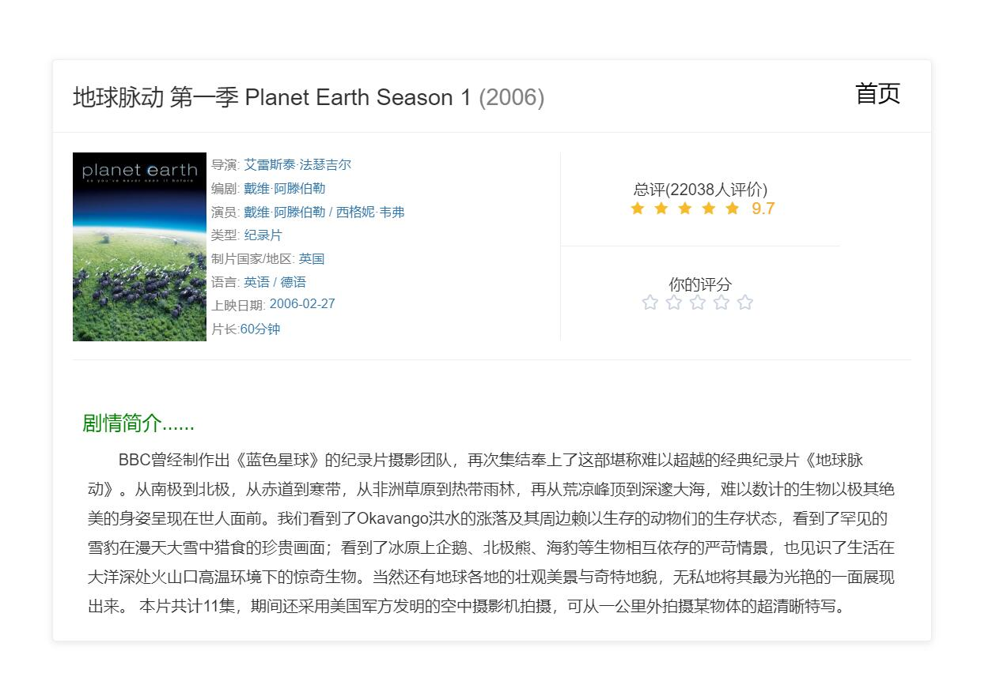

## 电影排行榜

### 地址

- [http://47.100.225.59](http://47.100.225.59) 

  

### 功能

- #### 基础功能
  - 电影列表
  - 分页功能
  - 布局合理,简洁美观
  - **在第二次的基础上** 
  - 加上了记住排序方式和页码的功能，即从详情页回到首页会保持原来的状态
    - 加载失败的图片会更换为加载失败
  
- #### 附加功能
  - 实现了 **排序** 功能(可按照评分,评分人数和上映日期来排序)
  - 实现了 **详情页** 功能
  - 实现了 **用户评分** 功能(在详情页中可以评分)

### 实现技术

- #### 前端
  - 使用 `vue.js` 框架和 `node.js` 开发

- #### 后端
  - 使用 `golang` 和 `echo` 框架开发
  - 数据库使用 `MongoDB` 
  - 服务器使用 `nginx` 

### 截图

#### 首页

#### 详情页

